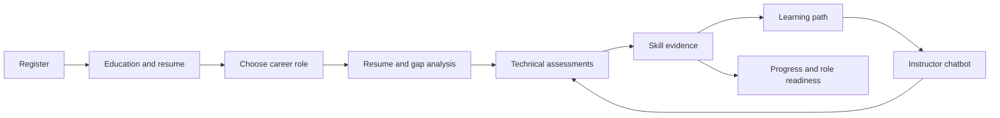
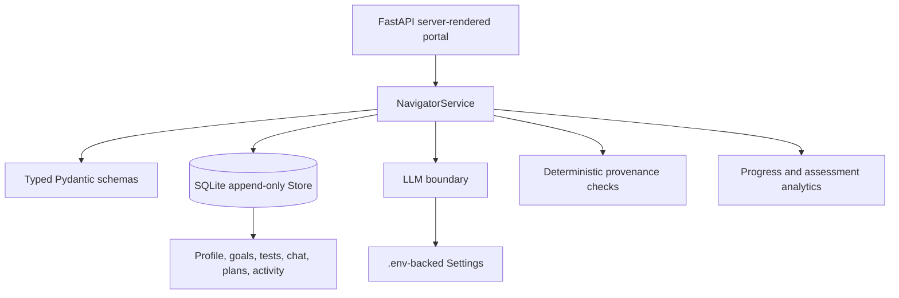

# Skill-Pilot

Skill-Pilot is a personalized career-learning portal for students. It combines
resume evidence, education details, a chosen career goal, technical assessments,
learning paths, an instructor chatbot, progress analytics, and curated resources
into one durable student profile.

The product is intentionally built as a single context-aware agent surrounded by
typed domain services and an append-only SQLite history. The agent teaches and
analyzes; deterministic code owns validation, persistence, scoring, provenance,
bounded control flow, and page rendering.

It runs as a server-rendered FastAPI application under Uvicorn. There is no
Streamlit app, JavaScript build pipeline, or separate frontend service.

## Why It Exists

Students often receive disconnected advice:

- A resume review is separate from a target role.
- A career goal is separate from measurable skill evidence.
- A quiz gives a score but does not create a next step.
- A learning plan becomes a static list instead of an evolving path.
- Progress views show activity without explaining readiness.

Skill-Pilot connects those pieces. A student's selected role determines the
required topics. Resume evidence and assessments contribute to the skill profile.
Gaps drive the learning plan, instructor context, refresh recommendations,
resources, and possible role matches.

## Core Workflow



### 1. Registration and profile

The registration flow collects:

- Name, college, department, graduation year, and email.
- Education level and CGPA/GPA.
- A target career role.
- A PDF or TXT resume.

Resume text is extracted at upload time. The original file is not stored in the
SQLite profile; extracted text is retained as the input to the resume agent.
Profile details and the resume can be edited later from **Profile**.

### 2. Career goals

The student chooses the primary role. Supported role templates currently include:

| Role | Required topics |
|---|---|
| Software Engineering Intern | Python, SQL, DSA, REST APIs, Git |
| Backend Developer | Python, SQL, REST APIs, Docker, Database Design |
| Frontend Developer | JavaScript, TypeScript, React, CSS, HTML |
| Data Analyst | Python, SQL, Pandas, Tableau, Statistics |
| Machine Learning Engineer | Python, PyTorch, Math & Stats, DSA, MLOps |
| Cloud Engineer | Linux, Docker, Kubernetes, AWS, Networking |

Changing the role synchronizes the demonstrated-skills surface, gap analysis,
learning-plan priorities, dashboard metrics, assessments, resources, and
instructor context. Existing evidence for shared skills is preserved; new role
topics begin as beginner-level evidence until assessed.

### 3. Resume and skill-gap analysis

The resume agent compares the student's resume with the current role rubric. It
can extract skills, estimate evidence levels, identify high-priority gaps, and
write a durable gap report. When no API key is available, the portal still works
using deterministic role benchmarks and a safe local fallback.

### 4. Technical assessments

Assessments are topic-based rather than generic career surveys. The topic list is
the current role's required skill list. Selecting a topic creates a fresh
ten-question test; submitting it stores the score and updates the topic history.
Selecting the same topic again creates another attempt.

Question content is technical and language-aware. Examples include:

- Python immutability, list aliasing, exceptions, comprehensions, and mutable
  default arguments.
- SQL joins, aggregation, indexes, transactions, constraints, and query clauses.
- DSA complexity, queues, stacks, trees, graphs, and dynamic programming.
- REST methods, status codes, idempotence, authentication, and pagination.
- JavaScript scope, closures, promises, coercion, array methods, and mutation.

The generated assessment contract contains the question, four options, the exact
correct answer, and an explanation. Scores are displayed beside each topic and
are used by the progress analytics.

### 5. Instructor chatbot

**AI Coach** is an instructor-only chat page, not a general-purpose assistant.
Each response receives current student context:

- Target role and required skills.
- Current skill scores.
- Latest gap report.
- Active misconceptions.
- Education and CGPA context.
- Recent chat history.

The instructor prompt requires a short explanation, a concrete example, and a
check-for-understanding question. It teaches only role-related or gap-related
topics and redirects unrelated requests. Chat messages are persisted in SQLite,
so the conversation survives a restart.

The UI renders common model markdown such as headings, bold text, and bullet
lists into readable chat content.

### 6. Learning paths

The dashboard exposes selectable paths for the role's topics. Selecting a path
does not erase the current plan. It appends a new path with:

1. A foundations/concept-map step.
2. An applied-project step.
3. A matching assessment step.

The Learning Plan page shows the accumulated schedule. The Progress page renders
the same plan as a tree with topic status and confidence percentage. This keeps
the dashboard selection, active plan, and progress visualization synchronized.

### 7. Progress and readiness analytics

The Progress page computes its values from stored profile, assessment, activity,
and learning-plan records. It includes:

- Required-topic completion percentage.
- Number of submitted assessments.
- Recorded learning events.
- Skill distribution pie chart.
- Date-based learning-rate line graph using assessment scores.
- Per-topic confidence on the current learning path.
- Topics that have not been touched recently.
- Extra skills that should be learned next.
- Possible roles ranked by current role-skill fit.
- An activity timeline with durable evidence events.

Stale topics are actionable. Clicking one opens a confirmation dialog and then
starts a fresh assessment for that exact topic.

### 8. Resources

The Resources tab appears above Logout in the authenticated navigation. It lists
the current role's topics as tiles. Each tile can include:

- Official documentation.
- Online courses.
- Interactive references.
- Books.

Resources change when the target role changes. Links open in a new browser tab
with `noopener noreferrer` protection.

### 9. Job-description analysis

The job analyzer accepts pasted job-description text and produces:

- Extracted requirements.
- Importance and required level.
- Source quotes.
- Verification status.
- A profile-to-job skill-gap report.
- A proposed learning plan.
- A human approval checkpoint.

The provenance checker verifies that a claimed quote actually appears in the
source text. Fabricated requirements are marked excluded rather than silently
accepted. This also limits the effect of prompt injection embedded in untrusted
job-description text.

### 10. Human approval checkpoints

The agent does not silently change a student's learning plan. Recommendations
are stored as `WAITING_FOR_STUDENT` checkpoints and can be accepted or rejected.
The checkpoint decision is recorded separately from the proposed plan.

The standalone [expert callback page](web/expert.py) demonstrates the same
human-in-the-loop principle for a person answering a question. A waiting run is
persisted, resumable, and time-bounded rather than held in a blocking process.

## What Makes It Novel

### One agent with a complete student context

The system does not create artificial personas for resume analysis, coaching,
planning, and assessments. One personalized instructor/analysis agent reads the
same durable profile and role context. This avoids fragmented memory and keeps
the student's experience coherent.

### The target role is a live control variable

The role is not only displayed as a label. It controls required skills,
demonstrated skills, gap priorities, assessments, resources, learning paths,
progress completion, and possible-role analysis. Changing the role changes the
whole learning system.

### Learning is evidence-driven

The portal distinguishes self-reported resume evidence from assessment and
verified learning evidence. A score is not treated as a vague recommendation; it
is written as a typed record with a source and timestamp.

### Plans are composable, not disposable

Selecting a new path integrates it with the current path. This mirrors how real
students learn: they add a missing competency without losing everything already
planned.

### Deterministic safety around model judgment

Models can analyze, teach, and propose. Code decides:

- Which student and role are active.
- Which skills are allowed for a role.
- Whether a source quote is real.
- How scores and completion are calculated.
- How many steps or retries are allowed.
- Whether a human approval is still pending.

That division makes the system inspectable and testable.

## Architecture



### `web/`

- `web/portal.py` is the main Skill-Pilot application.
- It provides authentication, registration, profile, goals, analysis, coach,
  assessments, learning plans, progress, resources, job analysis, and demo
  routes.
- `web/expert.py` is the lightweight human callback interface.

### `navigator/`

- `navigator/schema.py` defines typed records for profiles, skills, questions,
  gaps, plans, checkpoints, and activity.
- `navigator/services.py` owns student-domain behavior and SQLite writes.
- `navigator/provenance.py` verifies extracted quotes against source text.
- `navigator/stub.py` runs the deterministic Arun end-to-end demonstration.

### `slice/`

The reusable agentic spine contains:

- `store.py`: append-only SQLite versions, replay, history, counters, and
  questions.
- `runner.py`: bounded state-machine execution.
- `llm.py`: the single model boundary with typed parsing, fallback handling,
  token accounting, repair behavior, and error classification.
- `config.py`: one environment-backed configuration source.
- `budget.py`: run-level token and attempt fences.
- `retrieve.py`: local embeddings, vector search, and source chunks.
- `callback.py`: suspend, answer, timeout, and resume behavior.
- `records.py`: run states and immutable version records.

### Append-only state

The database does not overwrite history. New profile versions, assessment
attempts, decisions, chat messages, and plans are appended with a sequence and
producer. SQLite triggers reject updates and deletes on the versions table.
This enables restart survival, auditability, replay, and progress calculations.

## Quick Start

### Requirements

- Python 3.11 or newer recommended.
- A browser.
- An optional OpenRouter or compatible API key for live model calls.

### Install

```powershell
python -m venv .venv
.venv\Scripts\Activate.ps1
python -m pip install -r requirements.txt
```

On macOS/Linux:

```bash
python3 -m venv .venv
source .venv/bin/activate
python -m pip install -r requirements.txt
```

### Configure the model

Copy `.env.example` to `.env` and set the key:

```powershell
Copy-Item .env.example .env
```

### Quickstart & Configuration

Configure `.env` in the root folder:

```dotenv
OPENROUTER_API_KEY=your-openrouter-key
PLACEMENT_PORTAL_URL=https://q0wxbt85-3000.inc1.devtunnels.ms
PLACEMENT_PORTAL_STUDENT_ID=AU2027CSE001
PLACEMENT_PORTAL_PASSWORD=student123
SLICE_MODEL=inclusionai/ling-3.0-flash
SLICE_FALLBACK_MODEL=mistralai/mistral-small-3.2-24b-instruct
SLICE_MAX_TOKENS=1200
SLICE_MAX_TOKENS_PER_RUN=250000
```

### Start the Portal

```powershell
# See RUN.md for exact one-command startup instructions
uvicorn web.portal:app --host 127.0.0.1 --port 8000 --reload
```

Open <http://127.0.0.1:8000>.

### Multi-User Career & Placement Portal Agent Integration

Skill-Pilot treats every student as an independent user:
- **Registration & Profile Creation**: Register at `/register` to provision a unique student ID, resume text, and career goal.
- **Dynamic Placement Portal Synchronization**: Before searching or applying for drives, the Playwright agent verifies the student on the Mock Placement Portal (`PlacementPortalClient`), auto-provisions missing profiles, and authenticates the student's session.
- **Live Drive Matching & Application**: Reads live recruitment drives, computes role-fit scores against student skills, and executes deterministic eligibility checks before submitting applications into the CUIC placement database.

### Main Routes

| Route | Purpose |
|---|---|
| `/login` | Student authentication with clean credential verification |
| `/register` | Create a new student learning profile with education, goal, and resume PDF upload |
| `/` | Personalized student dashboard, active career goal, and skill analytics |
| `/career-analysis` | Resume-driven skill gap report and role readiness |
| `/career-goals` | Manage and update active target career role |
| `/learning-coach` | Context-aware AI career instructor chat and misconception untangling |
| `/assessment` | Diagnostic topic assessments, audio transcription, attempts, and scores |
| `/resume-builder` | AI-powered ATS resume builder, keyword match brackets, and regeneration |
| `/job-analyzer` | Real-time job description requirement extraction and provenance verification |
| `/learning-plan` | Human-checkpoint approved adaptive learning schedules |
| `/progress` | Skill progress, mastery scores, timeline, and SQLite activity feeds |
| `/logout` | End student session |

## Tests and Diagnostics

Run the full suite:

```powershell
python -m pytest -q
```

Run focused domain tests:

```powershell
python -m pytest tests/test_navigator.py -q
python -m pytest tests/test_store.py tests/test_runner.py tests/test_callback.py -q
```

Run the environment doctor:

```powershell
python scripts/doctor.py
```

Run the deterministic smoke workflow without a key or network:

```powershell
python scripts/smoke.py run --stub
```

Run live integration tests only when a configured key and reachable provider are
available:

```powershell
python -m pytest tests/test_integration.py -v
```

The test suite covers typed records, durable state, append-only history,
checkpoint suspension/resume, bounded loops, provenance verification,
adversarial prompt-injection text, and the twenty-step student workflow.

## Benefits

### For students

- One profile connects resume, role, skills, assessments, and learning.
- The next action is based on actual gaps rather than generic advice.
- Technical tests reveal language and reasoning weaknesses.
- The instructor teaches from current evidence and misconceptions.
- Progress explains confidence, pace, stale topics, and possible roles.
- Curated resources reduce the search burden.

### For mentors and institutions

- Student progress is inspectable instead of hidden inside a chat transcript.
- Recommendations have explicit factors and human approval points.
- Assessment history supports targeted intervention.
- Role-fit views help identify students who need support before placement cycles.
- SQLite keeps the system simple to run and easy to audit.

### For developers

- The domain logic is readable Python rather than a framework abstraction maze.
- Typed Pydantic records expose contract errors early.
- The LLM boundary is isolated and configurable.
- The store supports replay and restart survival.
- Deterministic fallbacks make local development possible without a key.

## Important Boundaries

Skill-Pilot is a learning and readiness aid, not a hiring guarantee. Role-fit
percentages are calculated from the available profile and assessment evidence;
they are not labor-market predictions. Resume extraction depends on readable
text in the uploaded document. Model-generated analysis can be incomplete, so
the portal preserves evidence types and keeps the student in control of role and
plan decisions.

The project intentionally keeps orchestration and safety rules in code. A model
can produce a lesson, extract a skill, or suggest a plan, but it cannot silently
rewrite the student's career direction, bypass provenance checks, or approve a
learning-plan change.

## Repository Map

```text
agentic-slice-kit/
├── web/
│   ├── portal.py          FastAPI Skill-Pilot portal
│   └── expert.py          Human callback page
├── navigator/
│   ├── schema.py          Typed product records
│   ├── services.py        Student domain and agent services
│   ├── provenance.py      Deterministic citation verification
│   └── stub.py             Twenty-step demo workflow
├── slice/
│   ├── store.py           Append-only SQLite state
│   ├── runner.py          Bounded state machine
│   ├── llm.py             Single model boundary
│   ├── config.py          Environment settings
│   ├── budget.py          Token and attempt fences
│   ├── retrieve.py        Local vector retrieval
│   └── callback.py         Suspend/resume human questions
├── tests/                  Unit, domain, integration, and architecture tests
├── scripts/                Doctor, smoke, bakeoff, and maintenance commands
├── corpus/                 Reference research and role material
├── docs/                   Architecture, builder, designer, and verifier guides
├── requirements.txt
└── run.db                  Local SQLite state created by the portal
```

## Design References

- [`docs/ARCHITECTURE.md`](docs/ARCHITECTURE.md): detailed system principles and
  code anchors.
- [`docs/PRINCIPLES-BRIEF.md`](docs/PRINCIPLES-BRIEF.md): short explanation of
  durable state, typed contracts, bounded loops, provenance, and human-in-the-loop.
- [`docs/BUILDER.md`](docs/BUILDER.md): environment and model configuration.
- [`docs/DESIGNER.md`](docs/DESIGNER.md): problem framing and agent design.
- [`docs/VERIFIER.md`](docs/VERIFIER.md): walkthroughs, testing, and evidence.

## License and Contributions

This repository is an educational, working agentic slice. Keep changes small,
preserve typed boundaries, add a focused test for behavior changes, and avoid
putting credentials or private student data into the repository.
