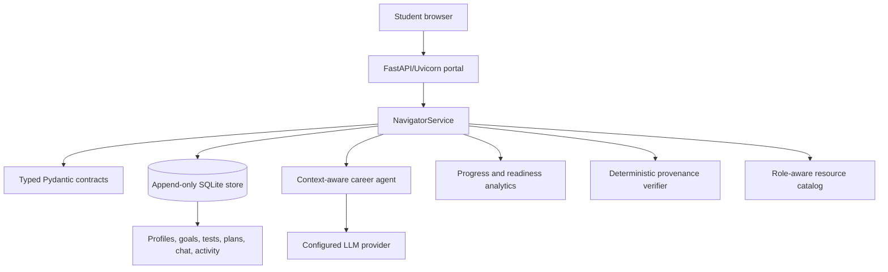

# Skill-Pilot Progress Report

> **Project status:** A polished, evidence-driven career-learning platform with
> a durable student profile, intelligent guidance, technical assessment, and a
> clear path from learning to employability.

<strong>Learn with evidence · Build with confidence · Move toward opportunity</strong>

---

## Executive Summary

Skill-Pilot is a focused, practical, and highly extensible career-learning platform designed to help students move from uncertainty to measurable career readiness. It brings together the student's education, resume, selected career goal, technical skills, assessments, learning plans, instructor guidance, resources, and progress evidence inside one coherent experience.

The project goes beyond a conventional dashboard or chatbot. It creates a continuously improving learning companion that understands the student's current direction, identifies the most important skill gaps, teaches the right concepts, measures progress, and turns every result into the next useful action.

The strongest achievement of the project is its combination of personalization and dependable engineering. The system feels intelligent because it maintains a rich student context, while remaining trustworthy because persistence, scoring, validation, provenance, and approval rules are controlled by deterministic application code.

### At a glance

| | Capability | Value |
|---|---|---|
| [x] | Personalized student context | Every recommendation is grounded in the student's current profile and goal. |
| [x] | Technical readiness measurement | Assessments turn learning progress into visible evidence. |
| [x] | Durable agentic workflow | Profile, plans, chat, scores, and decisions survive restarts. |
| [x] | Responsible automation | The agent recommends and teaches while the student remains in control. |

## Project Introduction

Many students receive career advice as disconnected pieces: a resume review in one place, generic tutorials in another, quizzes without meaningful follow-up, and job descriptions that are difficult to translate into a practical preparation plan.

Skill-Pilot addresses that gap with a single career-readiness journey:

1. The student creates a profile with education details, career direction, and resume.
2. The system analyzes the resume against the selected target role.
3. It identifies technical strengths and priority gaps.
4. The student takes topic-specific technical assessments.
5. An instructor-style AI coach teaches concepts using the student's current context.
6. The student selects learning paths that accumulate into a personalized plan.
7. Progress analytics show confidence, completion, learning pace, stale topics, and role readiness.
8. Curated resources guide the student toward high-quality next steps.

This creates a positive feedback loop: evidence improves the profile, the profile improves the recommendation, and each recommendation creates a clearer route toward the student's goal.

## Current Implementation Status

The project has progressed from an agentic framework into a complete, usable Skill-Pilot portal served by FastAPI and Uvicorn.

### Implemented capabilities

- [x] Server-rendered white-and-blue student portal.
- [x] Persistent cookie-based student sessions.
- [x] Registration with education details, CGPA/GPA, target role, and resume upload.
- [x] PDF and TXT resume text extraction.
- [x] Editable student profile and resume context.
- [x] Multiple target career roles with role-specific skill rubrics.
- [x] Automatic synchronization when the target role changes.
- [x] Resume-aware skill-gap analysis.
- [x] Technical ten-question assessments for individual topics.
- [x] Fresh assessment attempts for repeated practice.
- [x] Topic scores and assessment history.
- [x] Technical question banks covering code reasoning, debugging, language constructs, algorithms, databases, APIs, and frontend concepts.
- [x] Instructor-only AI coaching chatbot.
- [x] Context-aware teaching based on the current student profile.
- [x] Markdown-aware formatting for readable instructor replies.
- [x] Composable learning paths that can be added without deleting previous work.
- [x] Learning-path tree visualization with topic status and confidence percentage.
- [x] Progress completion metrics.
- [x] Skill-distribution pie chart.
- [x] Date-based learning-rate line graph.
- [x] Topic refresh recommendations with direct assessment links.
- [x] Possible-role recommendations based on current performance and resume evidence.
- [x] Curated topic resources including documentation, courses, interactive references, and books.
- [x] Job-description extraction and skill-gap analysis.
- [x] Deterministic source-quote provenance verification.
- [x] Human approval checkpoints for learning-plan changes.
- [x] Durable append-only SQLite state.
- [x] No-key fallbacks for important local demonstrations.

The result is a strong foundation for an intelligent career operating system rather than a one-time assessment application.

## Architecture

> **Design principle:** The model supplies judgment and teaching; deterministic
> services supply memory, validation, scoring, safety, and control.

Skill-Pilot follows a clear separation between intelligent judgment and dependable application control.

### Web application layer

`web/portal.py` provides the complete student experience. It handles authentication, registration, dashboard rendering, career goals, profile updates, resume uploads, coaching chat, assessments, learning plans, progress analytics, resources, job analysis, and the demonstration workflow.

The application intentionally remains simple to run. It uses FastAPI, server-rendered HTML, CSS, and Uvicorn. There is no unnecessary frontend build system, which keeps the project fast to start, easy to inspect, and well suited to demonstrations and educational environments.

### Navigator domain layer

`navigator/services.py` is the product intelligence layer. It owns the career domain rules and coordinates:

- Student profiles and evidence.
- Role-specific skill requirements.
- Resume analysis.
- Gap reports.
- Assessment generation and scoring.
- Instructor context.
- Learning-plan composition.
- Progress analytics.
- Role-fit analysis.
- Resource recommendations.

`navigator/schema.py` defines typed contracts for the major records. These contracts make the system easier to extend and substantially reduce ambiguity between UI, services, persistence, and model output.

### Agentic spine

The reusable `slice/` package provides the project's dependable foundation:

- `slice/store.py` provides durable append-only state and replayable history.
- `slice/runner.py` provides bounded state-machine orchestration.
- `slice/llm.py` centralizes model calls, structured parsing, fallbacks, token accounting, and model errors.
- `slice/config.py` provides one environment-backed configuration source.
- `slice/budget.py` protects the system with token and attempt fences.
- `slice/retrieve.py` supports local vector retrieval and evidence-oriented search.
- `slice/callback.py` supports suspend, human response, timeout, and resume behavior.

This architecture gives Skill-Pilot a particularly valuable quality: the system can be intelligent without becoming unpredictable.

## End-to-End Workflow

The experience is designed to feel like a guided progression rather than a
collection of disconnected screens.

### Profile creation

The student begins with a complete profile rather than a blank chat window. Education details, CGPA/GPA, target role, and resume context establish a meaningful starting point for personalization.

### Resume understanding

The resume is converted into usable text and passed into a role-aware analysis process. The platform can identify skills, estimate evidence levels, highlight gaps, and create a durable analysis record.

### Role selection

The target role is a live system variable. A change from Software Engineering Intern to Frontend Developer, Data Analyst, Cloud Engineer, or another supported role updates the relevant skill surface throughout the portal.

This is one of the project's strongest user experiences: the dashboard, assessments, learning paths, resource tiles, progress calculations, and instructor context all move with the student's new ambition.

### Technical assessment

The assessment experience is designed to test understanding, not just recognition. Questions include:

- Immutable and mutable data structures.
- Code output prediction.
- Debugging and error identification.
- Complexity analysis.
- SQL joins, aggregation, and transactions.
- HTTP methods and status codes.
- JavaScript scope, promises, closures, and coercion.
- Practical language and framework behavior.

A student can select a topic, complete ten questions, receive a score, review explanations, and immediately attempt a fresh set. This makes assessment a recurring learning instrument rather than a one-time gate.

### Instructor teaching

The AI Coach is designed as an instructor, not an unrestricted general assistant. It receives the latest student context and focuses on teaching topics connected to the current career direction and known gaps.

The instructor can explain a concept, provide an example, ask a check-for-understanding question, and respond to the student's current learning needs. Conversation history is persisted, allowing the student to build continuity across sessions.

### Learning-plan construction

The platform generates a prioritized plan from current gaps and evidence. Students can select additional topic paths from the dashboard. New paths are integrated with the current plan, creating a growing structure of foundations, applied practice, and assessment.

This is an especially strong design choice because student learning is rarely perfectly linear. Skill-Pilot supports a realistic, evolving preparation journey without discarding previous work.

### Progress interpretation

The Progress page transforms raw activity into an understandable readiness picture:

- What has been completed.
- Which skills are strong or developing.
- How quickly the student is improving.
- Which topics need refreshing.
- What confidence exists in the current path.
- Which additional skills should be prioritized.
- Which roles are becoming realistic application targets.

The student receives direction, not merely data.

## Novelty and Differentiation

> Skill-Pilot is not merely a chatbot with a dashboard. It is a connected,
> evidence-aware learning system in which every interaction improves the next
> recommendation.

### A complete context instead of isolated AI features

Many career tools provide one feature well: resume feedback, quizzes, or job recommendations. Skill-Pilot connects all of them through a single durable student context.

The same role and evidence model influences every major surface. This creates consistency across the experience and makes every interaction more meaningful.

### Role changes propagate through the entire product

A role selector is often just a label in ordinary applications. Here it becomes a control variable for the complete learning system. Changing the target role changes the required skills, assessment topics, path options, resources, progress interpretation, and instructor behavior.

### Technical learning over generic motivation

Skill-Pilot emphasizes concrete technical understanding. Students encounter code, language constructs, algorithms, data structures, databases, APIs, and debugging situations. This makes the product useful for actual preparation rather than only providing encouraging prose.

### Evidence-aware personalization

The platform distinguishes between self-reported resume information, assessment evidence, projects, and verified learning. That distinction makes the system more honest and enables better recommendations.

### Human control remains central

The agent can analyze and recommend, but the student remains the decision maker. Learning-plan updates can be held in explicit approval checkpoints. This creates a healthy balance between automation and agency.

### Educationally valuable architecture

The project is not only useful as a product; it is also an excellent demonstration of how to build responsible agentic systems. Its design makes persistence, typed contracts, bounded loops, provenance, fallbacks, and human-in-the-loop behavior visible and understandable.

## Applications

Skill-Pilot can be applied across a broad range of education and career-readiness environments.

### University placement preparation

Institutions can provide students with a role-specific preparation environment before recruitment season. Students can see exactly which skills need attention and practice them through measurable assessments.

### Department-level skill development

Computer science, information technology, data, electronics, and management departments can define role pathways for their own programs and monitor aggregate learning progress.

### Internship preparation

Students preparing for internships can use resume analysis and technical assessments to identify weaknesses earlier, giving them time to build evidence through projects and practice.

### Mentorship programs

Mentors can use the progress history, gap reports, misconception evidence, and learning paths to conduct more focused sessions.

### Bootcamps and training academies

Training providers can use the platform as a personalized layer around existing curricula, helping learners follow different paths while retaining a common structure for progress and assessment.

### Career transition programs

Professionals moving toward development, analytics, cloud, machine learning, or frontend careers can use the same role-driven approach to identify transferable strengths and missing competencies.

### Employability analytics

With appropriate privacy and governance, institutions can understand which technical topics create the largest readiness gaps and improve curriculum planning accordingly.

## Benefits

### Why the project stands out

- [x] It turns career goals into an actionable technical preparation system.
- [x] It connects resume evidence, assessments, coaching, paths, and roles in one loop.
- [x] It makes progress understandable to both students and mentors.
- [x] It combines ambitious AI behavior with visible, testable engineering rules.

### Benefits for students

- A single profile connects ambition, evidence, learning, and outcomes.
- The next learning action is personalized rather than generic.
- Technical assessments reveal concrete knowledge gaps.
- The instructor provides context-aware explanations.
- Progress is visible through confidence, pace, completion, and role fit.
- Curated resources reduce the time spent searching for quality material.
- Learning paths remain flexible as interests evolve.

### Benefits for educators and mentors

- Student discussions begin with evidence rather than guesswork.
- Assessment history reveals recurring misconceptions.
- Learning plans expose priorities and recommended practice.
- Human approval checkpoints preserve mentor and student control.
- Progress records create a valuable basis for intervention and encouragement.

### Benefits for institutions

- A scalable preparation experience can support many roles and cohorts.
- Role-specific data can reveal curriculum-level weaknesses.
- The system is lightweight to deploy and easy to demonstrate.
- Durable records improve accountability and continuity.
- The architecture supports gradual expansion without requiring a complete rewrite.

### Benefits for developers

- The product has clear ownership boundaries.
- Model behavior is isolated behind typed and configurable interfaces.
- The SQLite history makes debugging and replay practical.
- Deterministic fallbacks enable local development without expensive calls.
- New roles, question banks, resources, and analytics can be added incrementally.

## Future Improvements

Skill-Pilot already provides a strong and impressive career-learning foundation. Its architecture is deliberately prepared for the next generation of career intelligence features.

> **Vision:** Extend Skill-Pilot from a preparation companion into a complete,
> student-controlled career journey: discover the right opportunity, prepare
> intelligently, communicate confidently, and apply with evidence.

### Career-portal simulation and live job discovery

A future version can simulate or integrate with a career portal that retrieves job descriptions based on:

- The student's target role.
- Preferred location.
- Experience level.
- Salary expectations.
- Technology interests.
- Current strengths and missing skills.

The agent could fetch job descriptions, extract requirements, compare them with the student's latest profile, and rank opportunities by realistic readiness rather than title similarity alone.

A powerful next step would be a job opportunity workspace where each job includes:

- Requirement extraction.
- Skill-match percentage.
- Missing competencies.
- Evidence the student already has.
- A recommended preparation path.
- Suggested portfolio improvements.
- A transparent explanation of why the opportunity is a good fit.

### Assisted job application preparation

With explicit student approval, Skill-Pilot could help prepare applications by:

- Selecting jobs aligned with interest and demonstrated strengths.
- Generating a role-specific application checklist.
- Suggesting resume changes grounded in real experience.
- Preparing a cover-letter draft for review.
- Identifying projects that best support the application.
- Tracking application status and follow-up actions.

The design should keep final submission under student control. The system can prepare and explain; the student should approve what is sent.

### Voice-based oral-answer assessment

A future voice layer could assess spoken technical answers using audio input. Students could answer questions aloud and receive feedback on:

- Technical correctness.
- Clarity of explanation.
- Structure and sequencing.
- Use of examples.
- Confidence and hesitation patterns.
- Conciseness.
- Whether the answer directly addresses the question.

This would add an important dimension that written assessments cannot capture: the ability to communicate technical reasoning under interview conditions.

### Oral interview training

Skill-Pilot could introduce a realistic interview simulator with:

- Technical screening rounds.
- Behavioral interview questions.
- Role-specific follow-up questions.
- Timed response windows.
- Voice or video response options.
- Adaptive difficulty based on previous answers.
- Feedback after each response.
- Full mock interview reports.

The agent could notice when a student knows the concept but struggles to explain it, then create targeted speaking practice.

### Adaptive interview difficulty

As scores and confidence improve, the platform could automatically move from fundamentals to:

1. Recall questions.
2. Code comprehension.
3. Debugging.
4. Design trade-offs.
5. Open-ended implementation.
6. System-design discussion.
7. Realistic interviewer follow-up.

This would create a smooth progression from learning to interview performance.

### Portfolio and project verification

Future versions could connect project evidence to GitHub repositories, deployed applications, notebooks, certificates, and demonstrations. The platform could help students convert projects into verifiable evidence rather than vague resume claims.

### Mentor collaboration

A mentor workspace could allow approved mentors to:

- Review gap reports.
- Comment on learning paths.
- Approve or modify recommendations.
- Add expert evidence.
- Recommend project opportunities.
- Track improvement across a cohort.

The existing human-in-the-loop checkpoint architecture is an excellent foundation for this collaboration model.

### Institutional analytics

A privacy-aware institutional layer could provide anonymized insights such as:

- Most common skill gaps by department.
- Topics with the lowest assessment confidence.
- Average time to role readiness.
- Resource effectiveness.
- Assessment difficulty trends.
- Placement-season readiness movement.

### Multilingual instruction

The instructor could eventually teach concepts in regional languages while preserving technical keywords in English. This would improve accessibility for students who understand technical ideas better when explanations are bilingual.

### Personalized resource ranking

Resources could be ranked by learning style, prior success, difficulty, time available, and preferred format. A student with thirty minutes might receive an interactive exercise, while another student might receive a book chapter and a project task.

### Privacy and production hardening

A production-ready version would add:

- Secure password hashing instead of the current demonstration-oriented hashing.
- CSRF protection for forms.
- Encrypted or separately managed sensitive resume storage.
- Role-based mentor and administrator access.
- Audit-friendly consent records.
- Data retention and deletion controls.
- Rate limiting and upload validation.
- Secure secret management.
- Structured observability and production metrics.

These improvements would make the already strong educational prototype suitable for larger institutional deployments.

## Conclusion

Skill-Pilot demonstrates how an agentic application can be both ambitious and disciplined. It does not stop at a chatbot, a resume parser, or a collection of quiz pages. It creates a connected learning system in which every important interaction contributes to a durable picture of the student's progress.

Its most compelling promise is simple: a student can begin with a goal, understand the gap between their current evidence and that goal, learn through targeted instruction, practice through technical assessments, build an evolving learning path, and see a clearer set of opportunities emerge over time.

The current project is already a polished and meaningful foundation. With job discovery, assisted applications, voice-based assessment, oral interview coaching, mentor collaboration, and stronger institutional analytics, Skill-Pilot can grow into a complete career-readiness companion that helps students not only find opportunities, but become genuinely prepared for them.
